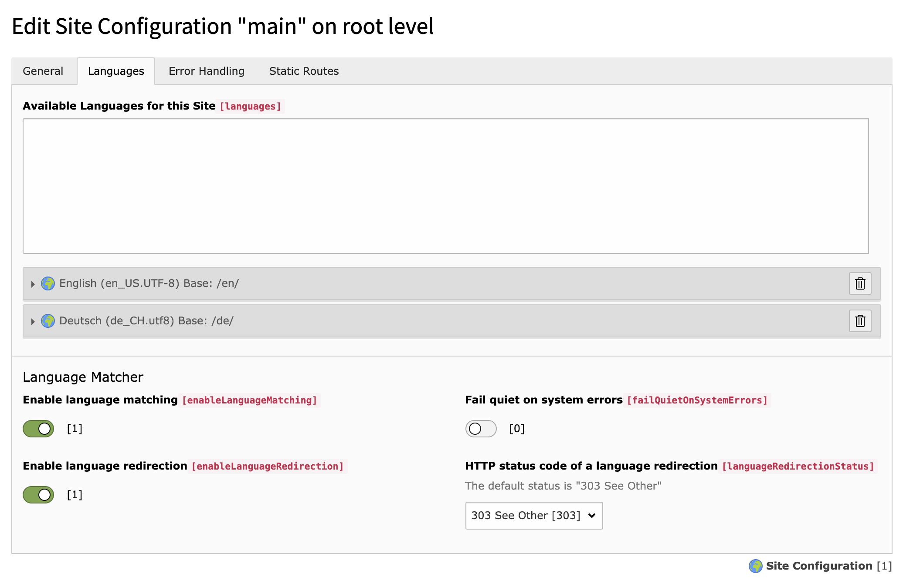

.. include:: ../Includes.txt

.. _introduction:

============
Introduction
============

.. _what-it-does:

What does it do?
================

This extension basically implements a mechanism that matches the
:code:`Accept-Language` HTTP header from a request with available site
languages.

The results of the matching can then be used to redirect a client automatically
to it's favourite language. In this case, a cookie is used to prevent
redirection loops.

Redirection can be disabled though. In this case, the results of the matching
will be made available as
:ref:`Aspect <matchedlanguageaspect>` through the TYPO3 Context API.

While this extension is pretty zero-configuration, it offers some basic switches
to fiddle with (see :ref:`configuration-site`).

.. _screenshots:

Screenshots
===========

   Extension of the built-in Site Configuration
